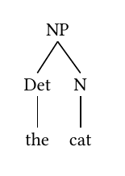
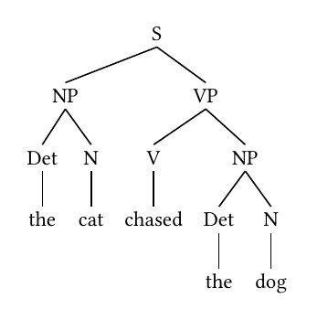
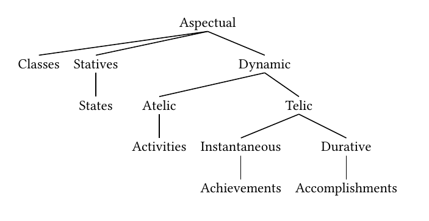
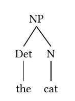
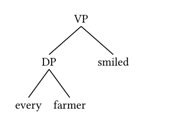

```{r setup-0, include = FALSE}
message("current_input: ", knitr::current_input(dir = TRUE))
message("getwd: ", getwd())
message("vig_dir would be: ", dirname(knitr::current_input(dir = TRUE)))
```


```{r setup, include = FALSE}
knitr::opts_chunk$set(
  collapse  = TRUE,
  comment   = "#>",
  eval      = FALSE,
  out.width = "40%"
)
library(toolero)

# Build absolute paths to figures using this vignette file's location.
# knitr::current_input(dir = TRUE) returns the absolute path to the
# currently executing vignette regardless of the working directory,
# which varies between interactive knitting and R CMD check.
vig_dir <- dirname(knitr::current_input(dir = TRUE))
fig_dir  <- file.path(vig_dir, "figures")
```


## The problem

Syntactic trees are a staple of linguistics. Whether you are analyzing argument
structure, working through a derivation in a Minimalist framework, or simply
illustrating the constituent structure of a sentence for a course handout, you
need a way to produce clean, readable tree diagrams.

For a long time, the standard answer was LaTeX. Packages like `forest`,
`tikz-qtree`, and `gb4e` have served linguists well, and they remain powerful
tools for complex diagrams. But they come with significant overhead: a full
LaTeX installation, custom `.sty` files, and a build pipeline that can be
difficult to integrate with modern R-based workflows. If your analysis lives in
a Quarto document, a Shiny app, or an R Markdown report, pulling in LaTeX just
to draw a tree is a heavy dependency for a relatively simple task.

The situation is further complicated when you want to embed a tree in a format
that has nothing to do with LaTeX — a Word document, a Keynote slide, a webpage.
A PDF compiled from LaTeX does not travel well.

## How `arborize()` solves it

`arborize()` takes a syntactic tree description as a character string, renders
it using Quarto's Typst engine, and exports the result as a standalone PNG
image. The PNG can be embedded anywhere: in a Quarto document, an R Markdown
report, a Word file, a presentation, or uploaded directly to a content
management system.

The function handles the entire pipeline internally:

1. It builds a minimal throwaway Quarto document containing the tree
2. Quarto renders the document via Typst to an intermediate PDF
3. The PDF is converted to PNG at the requested resolution
4. Temporary files are cleaned up automatically
5. Optionally, a provenance `.yaml` file is written alongside the PNG
   recording the tree string and all rendering arguments

No LaTeX required. No intermediate files left on disk. One function call,
one PNG.

### A note on first use

`arborize()` relies on Typst packages hosted at the Typst package registry.
On first use, Typst will download the required package to a local cache
(`~/.cache/typst/packages/`). This requires an internet connection. Subsequent
renders use the cached package and work offline.

## Two rendering backends

`arborize()` supports two rendering backends, controlled by the
`tree_notation` argument.

### `tree_notation = "simple"` — bracket notation

The default backend uses the `@preview/syntree` Typst package, which accepts
bracket notation. This is the most compact input format and the one most
linguists already know from X-bar theory textbooks and LaTeX forest notation.

Nodes are enclosed in square brackets. The first element of each bracket is the
node label; subsequent elements are daughter nodes. Leaf nodes appear without
brackets.

```
[S [NP [Det the] [N cat]] [VP [V sat]]]
```

This backend suits the majority of use cases: simple to moderately complex
phrase structure trees without specialized annotation.

### `tree_notation = "structured"` — lingotree notation

The structured backend uses the `@preview/lingotree` Typst package, which
accepts nested `tree()` function calls. The syntax is more verbose but more
expressive: it supports per-node styling, movement arrows between nodes, and
multi-dominant trees where a single node appears under two parents.

```
tree(
  tag: [VP],
  tree(
    tag: [DP],
    [every],
    [farmer]
  ),
  [smiled]
)
```

This backend is the right choice when you need fine-grained visual control or
when you are drawing structures from Government and Binding or Minimalist
frameworks where movement and multi-dominance are central.

The user is responsible for providing valid `tree()` syntax. The
`@preview/lingotree` documentation is the authoritative reference for the full
API.

## Getting the crop right: `papersize` and `margin`

Before diving into examples, it is worth understanding how `papersize` and
`margin` interact to determine what the final PNG looks like.

`arborize()` renders the tree onto a Typst page of the specified `papersize`.
That page becomes the PDF, which is then converted to PNG. If the page is much
larger than the tree, the PNG will have a lot of empty whitespace around the
tree — it will look small and lost in the image. If the page is too small, the
tree will be clipped.

The goal is to choose a `papersize` that fits snugly around the tree, with
`margin` providing a comfortable buffer. Think of it as choosing an envelope
that is just big enough for your letter.

### Choosing a papersize

Typst's paper sizes follow the ISO standard series. For reference:

| papersize | Dimensions | Good for |
|---|---|---|
| `"a7"` | 74 × 105 mm | Very small trees, 2–3 nodes |
| `"a6"` | 105 × 148 mm | Simple trees, 4–6 nodes |
| `"a5"` | 148 × 210 mm | Default — medium trees |
| `"a4"` | 210 × 297 mm | Wide or deep trees |
| `"a3"` | 297 × 420 mm | Very wide trees |

Start small and go up if the tree is clipped. A simple NP fits on `"a6"`.
A full clausal tree typically needs `"a5"`. The aspectual classes tree, which
branches very broadly, benefits from `"a4"`.

### Choosing a margin

The `margin` argument sets equal padding on all four sides of the page. The
default is `"0.5cm"`, which works well for most trees. Reduce it to `"0.2cm"`
for a tighter crop, or increase it to `"1cm"` if you want more breathing room
around a complex tree.

### The general workflow

A practical approach when sizing a new tree:

1. Start with `papersize = "a5"`, `margin = "0.5cm"` (the defaults)
2. If there is too much whitespace, drop to `"a6"` or `"a7"`
3. If the tree is clipped, move up to `"a4"` or `"a3"`
4. Adjust `margin` for final fine-tuning

## Examples

### A simple NP

The most basic case — a determiner phrase nested under a noun phrase. A simple
NP fits well on `"a6"`.

```{r simple-np, eval = FALSE}
arborize(
  "[NP [Det the] [N cat]]",
  output    = "figures/np-tree.png",
  papersize = "a6",
  margin    = "0.5cm"
)
```

```{r echo=FALSE, eval=TRUE, out.width="30%"}

```

### A clausal tree

A simple transitive clause with subject and object. The extra branching calls
for `"a5"`.

```{r clause, eval = FALSE}
arborize(
  "[S [NP [Det the] [N cat]] [VP [V chased] [NP [Det the] [N dog]]]]",
  output    = "figures/clause-tree.png",
  papersize = "a5",
  margin    = "0.5cm"
)
```

```{r echo=FALSE, eval=TRUE, out.width="55%"}

```

### Aspectual classes

The classic Vendlerian classification of verbal aspect — a wide, multi-level
tree. This one needs `"a4"` to accommodate its breadth, and a slightly larger
margin gives the labels room to breathe.

```{r aspectual, eval = FALSE}
arborize(
  paste0(
    "[Aspectual Classes ",
    "[Statives [States]] ",
    "[Dynamic ",
    "[Atelic [Activities]] ",
    "[Telic ",
    "[Instantaneous [Achievements]] ",
    "[Durative [Accomplishments]]]]]"
  ),
  output    = "figures/aspectual-classes.png",
  papersize = "a4",
  margin    = "1cm",
  dpi       = 300
)
```

```{r echo=FALSE, eval=TRUE, out.width="80%"}

```

### Print-quality output

For figures destined for publication, use `dpi = 600`. The default `dpi = 300`
is appropriate for screen use and general document embedding; 600 is the
minimum for print reproduction. Note that higher DPI produces a larger file
but does not change the crop — `papersize` and `margin` still control that.

```{r print-quality, eval = FALSE}
arborize(
  "[NP [Det the] [N cat]]",
  output    = "figures/np-tree-hires.png",
  papersize = "a6",
  margin    = "0.5cm",
  dpi       = 600
)
```

### Tight crop with a narrow margin

For trees that will be embedded in a document with its own padding, a tighter
crop often looks cleaner. Reducing `margin` to `"0.1cm"` crops very close to
the tree itself.

```{r tight-crop, eval = FALSE}
arborize(
  "[NP [Det the] [N cat]]",
  output    = "figures/np-tree-tight.png",
  papersize = "a6",
  margin    = "0.1cm"
)
```

```{r echo=FALSE, eval=TRUE, out.width="25%"}

```

### Structured notation with lingotree

A VP with a DP internal argument, rendered using the lingotree backend. Note
that the `tree()` string is passed verbatim to Typst — the syntax is Typst, not
R. Always pass `tree_notation = "structured"` when using lingotree; without it
`arborize()` defaults to the syntree backend and the output will be incorrect.

```{r lingotree, eval = FALSE}
arborize(
  "tree(
    tag: [VP],
    tree(
      tag: [DP],
      [every],
      [farmer]
    ),
    [smiled]
  )",
  tree_notation = "structured",
  output        = "figures/vp-lingotree.png",
  papersize     = "a6",
  margin        = "0.5cm"
)
```

```{r echo=FALSE, eval=TRUE, out.width="30%"}

```

### Suppressing the provenance file

By default `arborize()` writes a companion `.yaml` file alongside the PNG
recording the tree string and all rendering arguments. Pass `provenance = FALSE`
to suppress it.

```{r no-provenance, eval = FALSE}
arborize(
  "[NP [Det the] [N cat]]",
  output     = "figures/np-tree.png",
  papersize  = "a6",
  provenance = FALSE
)
```

## Working with provenance files

When `provenance = TRUE` (the default), `arborize()` writes a `.yaml` file
with the same stem as the PNG. For a call like:

```{r provenance-demo, eval = FALSE}
arborize(
  "[NP [Det the] [N cat]]",
  output    = "figures/np-tree.png",
  papersize = "a6",
  margin    = "0.5cm"
)
```

The directory will contain:

```
figures/
├── np-tree.png
└── np-tree.yaml
```

The `.yaml` file records everything needed to reproduce the render:

```yaml
rendered_by: toolero::arborize(), version 0.4.0
rendered_at: 2026-04-30 14:23:11 CDT
output: /path/to/figures/np-tree.png
tree_notation: simple
typst_package: '@preview/syntree:0.2.1'
dpi: 300
papersize: a6
margin: 0.5cm
tree: '[NP [Det the] [N cat]]'
```

To re-render from a provenance file — for example to increase the DPI for a
journal submission while keeping the exact same tree and crop settings — read
the `.yaml` and pass its fields back to `arborize()`:

```{r rearborize, eval = FALSE}
p <- yaml::read_yaml("figures/np-tree.yaml")

arborize(
  tree          = p$tree,
  output        = "figures/np-tree-hires.png",
  dpi           = 600,
  tree_notation = p$tree_notation,
  papersize     = p$papersize,
  margin        = p$margin,
  overwrite     = TRUE
)
```

The provenance file ensures that the high-resolution version is cropped
identically to the original — same `papersize`, same `margin`, different `dpi`.

A dedicated `rearborize()` function that wraps this pattern is not yet
implemented. If this would be useful to you, please file an issue at
<https://github.com/erwinlares/toolero/issues> — user demand is the most
direct signal that a feature is worth building.

## Embedding trees in documents

Once you have a PNG, embedding it in any R-based document is straightforward.

In a Quarto document or R Markdown:

````markdown
```{{r}}
#| label: fig-np-tree
#| fig-cap: "A simple NP"
#| out-width: "40%"

```
````

In a Quarto document using Markdown syntax directly:

```markdown
{width=40%}
```

Because `arborize()` produces a standard PNG, the tree can also be inserted
into Word documents via `officer`, added to a PowerPoint slide via `rvg`, or
uploaded directly to any content management system.

## Argument reference

| Argument | Default | Description |
|---|---|---|
| `tree` | — | Tree string in bracket or lingotree notation |
| `output` | `"syntactic-tree.png"` | Path to the output PNG file |
| `dpi` | `300` | Resolution in dots per inch |
| `tree_notation` | `"simple"` | `"simple"` for syntree, `"structured"` for lingotree |
| `papersize` | `"a5"` | Typst paper size; match to tree complexity |
| `margin` | `"0.5cm"` | Page margin; controls buffer around the tree |
| `provenance` | `TRUE` | Write companion `.yaml` provenance file |
| `overwrite` | `FALSE` | Overwrite existing output files |

## References

- Typst `syntree` package (v0.2.1): <https://typst.app/universe/package/syntree>
- Typst `lingotree` package (v1.0.0): <https://typst.app/universe/package/lingotree>
